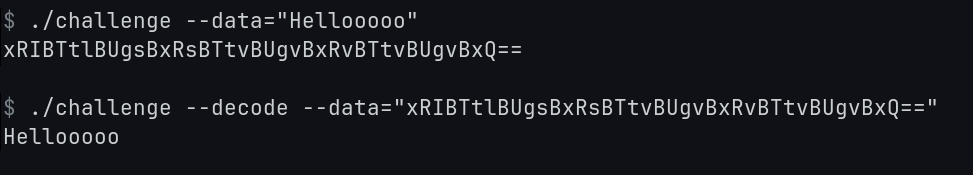

This is effectively a "fake" base64, made to trick someone into thinking it can be decoded as base64 as a starting step, when in reality the message is hidden within the "base64" string



# Building
```console
git clone https://github.com/kivattt/encoding-challenge
cd encoding-challenge
go mod tidy
go build
```

# Encoding
```console
./challenge --data="Message to encode"
```

# Decoding
```console
./challenge --decode --data="Encoded message goes here"
```
